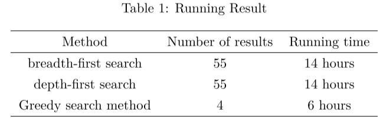

# Tangram_Solver

#### This repo is the final project assignment for 2022 Spring class: CS360 Artificial Intelligence, Faculty of Innovation Engineering, Macau University of Science and Technology. A Tangram Puzzle Solver, Pentagons Formation using Tangram Pieces.

#### For a detailed implementation of the algorithm and execution environment, see Final Report.pdf and Tangram Readme.pdf. 

#### Copyright, Manseui Chan, Wang and Beta. All rights reserved.

## Question description

Tangram is one of the most popular games to play with. You put figures of 7 pieces together (five triangles, one square and one parallelogram). You must use all pieces. They must touch but not overlap.

All seven tangram pieces consist of many half squares(triangles), each with this shape: 

	

There are 32 half squares or 16 squares altogether.

	

We could take the half-squared triangle as the basic form, because each square built for all seven tangram pieces has the simple length (perimeter) of 4 units.

There are many convex and non-convex figures/shapes of pentagons that you can build from all the 7 tangram pieces. Some of them are given below.

	

In this project, you are required to use AI search methods (uninformed search methods such as Breadth First search, Depth First search, Iterative Deepening and Uniform Cost search) and (Informed or heuristic search methods such as Greedy search, A* algorithm and Iterative Deepening version of A* : IDA*) to perform pattern matching, recognition and pentagons formation.

## A brief description of our method and the result

In this project, we use uninformed search methods - the breadth-first search(BFS) method and the depth-first search(DFS) method, and informed search method - Greedy search method to get formations of the pentagon through tangram pieces. After running our program, we finally get xxx formations of the pentagon through tangram pieces as the result.

Cloud server configuration: 32 cores 128GB 5Mbps;

System disk: high performance cloud hard disk;

Network: Default-VPC.

	

The following table shows the results and running time of each method.

	

### If U want to know more about this project, TRY TO READ "Final Report.pdf" and "Tangram Readme .pdf" is a Good Choice.

